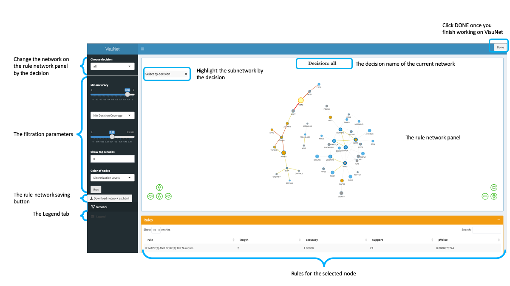

***

# Input formats {#InputFormats}
 

VisuNet is available for any rule-based classifier in supported data frame formats.
<br>

## 'Line by line' format {#LbL}

Data should be expressed as a data frame and needs to contain the following columns:

* `FEATURES` - the left-hand side of the rule corresponds to comma-separated attributes and their values, type factor 
* `DECISION` - the right hand side of the rule corresponds to decision value, type factor
* `ACC_RHS` - the rule accuracy, type numeric 
* `SUPP_RHS` - the rule support, type numeric

A p-value (`PVAL`) column is not obligatory.

```{r, echo = FALSE, warning=FALSE, message=FALSE, results='asis'}
library(VisuNet)
library(knitr)
library("kableExtra")
kable(autcon_ruleset[4:6,], format="html",  caption = "The sample 'line by line' data frame") %>%
  kable_styling(bootstrap_options = "striped", full_width = F, position = "left")
```


You can use 'line by line' format with the option:
`type = 'L`


```{r, echo = TRUE, fig.align='center', warning=FALSE, eval=FALSE}
rules <- data(autcon_ruleset)
vis_out <- visunet(rules, type = 'L')
```
<br>

## R.ROSETTA data frame {#RDF}

The rules data frame that is the output of R.ROSETTA can be directly run in VisuNet. See **?rosetta** from the [R.ROSETTA](https://github.com/komorowskilab/R.ROSETTA.git) package for details.

The R.ROSETTA output format can be use with the option:
`type = 'RDF` and this is the default variable.

```{r, echo = TRUE, fig.align='center', warning=FALSE, eval=FALSE}
#the rule-based model construction using R.ROSETTA
resultsRos <- rosetta(autcon)
vis_out <- visunet(resultsRos$main, type = 'RDF')
```

***
# Run VisuNet {#runVisunet}

VisuNet is an R package and it is implemented as  [Shiny Gadgets](https://shiny.rstudio.com/articles/gadgets.html), what enable to run VisuNet as an R function, while the rule set is an argument. 

```{r, echo = TRUE, fig.align='center', warning=FALSE, eval=FALSE}
require(VisuNet)

#Sample rule set for a classifier of autistic and non-autistic young males
#'Line by line' data type
data(autcon_ruleset)

#Run VisuNet
#Remember to click DONE once you finished your work with VisuNet
vis_out <- visunet(autcon_ruleset, type = 'L')
```

The available ´visunet´ parameters are:

* `ruleSet`  - the set of rules in one of available structure: [Input formats](#InputFormats)
* `type` - character string specifying the type of the input data. Two types implemented are:
    * `"RDF"` - the R.ROSETTA output (see  [R.Rosetta format](#RDF))
    * `"L"` - "Line by line" file format (see ['line by line' format](#Lbl)) The default is `"RDF"`
* `NodeColorType` - character string specifying the color of nodes: 
    * `"DL"` - feature discretization levels, option is available for data discretized into three levels: 1 (yellow), 2 (grey) and 3 (blue). In the case of the gene expression, data dicretization levels correspond to: 1 - underexpressed gene, 2 - no change gene expression and 3 - overexpressed gene.
    * `"A"` - color of nodes defined by the mean accuracy value for the node: dark orange - high accuracy value, light orange - low accuracy value. 

`CustObjectNodes` and `CustObjectEdges` parameters are optional and can be used when the [rule network customization](#RNCust) is needed. 

* `CustObjectNodes` - a list that contains customized VisuNet output for nodes. The list needs to contain two variables:
    * `nodes` - customized VisuNet output for nodes
    * `CustCol` - names of variables added/changed in the VisuNet output for nodes.

See [Nodes customization](#CustNodes) for details.

* `CustObjectEdges` - a list that contains customized VisuNet output for edges. The list needs to contain two variables:
    * `edges` - customized VisuNet output for edges
    * `CustCol` - names of variables added/changed in the VisuNet output for edges. 

See [Edges customization](#CustEdges) for details.


***
# The interface

<center>
[  ](images/VisuNet_interface.png) 
The VisuNet interface
</center>
<br>
VisuNet displays the rule network construct for the 10% of the rules with the highest connection value. When only one decision variable is visible in the top 10% of rules, we extend the threshold to obtain the rules for all decisions. The initial values of accuracy and support are defined for this set of rules.

The rule networks parameters panel:

* `min Accuracy` - the minimum accuracy value for the set of rules that create the rule network
* `min Support` - the minimum support value for the set of rules that create the rule network
* `Show top n nodes` - enable to show the exact number of the most significant nodes according the connection value from the current rule network, set 0 to switch off the parameters
* `Color of nodes` - the node color schema. See  `NodeColorType` in the [Run Visunet](#runVisunet) section for details.

***
# VisuNet output

The VisuNet output is a set of lists correspond to one decision variable plus one extra list for combined decision 'all'.
The lists contain information required to reproduce rule networks, i.e. data frames for `nodes`, `edges` and `NodeRulesSetPerNode` - a list that shows rules for each node.
Data frames for nodes and edges incorporate essential variables by a [visNetwork](https://github.com/datastorm-open/visNetwork) package and additional variables that describe the quality of the node/edge obtained from the rules.


Structure of the data frame for nodes:
 
* `id` - unique node id, according to the attribute value and their value from the left-hand side of the rule set
* `label` - the attribute variable without the '=value' part from the left-hand side of the rule set
* `DiscState` - the attribute value
* `color.background`  - the node color, see *node color types* for details
* `value` - the node size
* `color.border` - the color of node border
* `meanAcc` - the mean accuracy value from all rules that contain the node
* `meanSupp` - the mean support value from all rules that contain the node
* `NRules`  - the number of rules that contain the node
* `PrecRules` - fraction of rules that contain the node
* `NodeConnection` - the total connection value obtains from the rules that contain the node
* `title` - information visible on the tooltip
* `group` -  the decision variable that occurs the most frequently (>50%) in rules associated with the node, otherwise `group` contains all comma-separated decision variables corresponds to rules associated with the node. `group`  defines  the content of the 'Select by decision' drop-down box.

Structure of the data frame for edges:

* `from`, `to` -  the pair of nodes that create the edge       
* `conn`  - the connection variable obtained from the edge associated rules.
* `connNorm`  - the connection variable normalized according to the maximum connection variable in the rule network
* `label2` - the edge id
* `color` - the edge color                                                                          
* `title` - information visible on the tooltip
* `width` - the edge width, defined according to the normalized connection value


***
# Rule network customization {#RNCust}


Rule networks are constructed using a [visNetwork](https://github.com/datastorm-open/visNetwork) package that enable to add/change node and edge properties, e.g. change the color of nodes or the edge type according to the specific conditions. We are not limited to the existing variables in a rule network object, but we can add new ones that are implemented in [visNetwork](https://github.com/datastorm-open/visNetwork). See **?visNodes** and **?visEdges** for a full list of available options.
<br>

## Nodes customization {#CustNodes}

We identified 11 genes previously reported in databases of autism associations: [SFARI](https://gene.sfari.org/), [AutDB](http://autism.mindspec.org/autdb/Welcome.do) and [ASD](http://asd.princeton.edu). We would like to mark that genes as stars. The example shows how to do this:

```{r, echo = TRUE, fig.align='center', warning=FALSE, eval=FALSE}
#genes reported in databases of autism associations
aut_genes <- c('TSPOAP1', 'COX2','NCS1','RHPN1','FLRT2',
              'BAHD1','NCKAP5L','PPOX', 'NGR2',
              'ATXN8OS','DEPDC1')

#create the new variable that contains nodes information for 'all' decisions
nodes_RNO <- vis_out$all$nodes

#create the new vector of variables: shape. 'dot' is the default shape of nodes
nodes_RNO$shape <- rep('dot', length(nodes_RNO$label))

#mark selected genes as stars using the label attribute 
nodes_RNO$shape[which(as.character(nodes_RNO$label) %in% aut_genes)] <- 'star'

#create the node object list
nodesL <- list(nodes = nodes_RNO,CustCol =  c('shape'))

#rerun VisuNet with a new shape of nodes
vis_out2 <- visunet(autcon_ruleset, type = 'L', CustObjectNodes = nodesL)
```

To rerun VisuNet with the customized object for nodes,  you need to provide the original rule set and a list `CustObjectNodes` that contains the customized VisuNet object for nodes.
`CustObjectNodes` includes the customized object for nodes: `nodes` and a vector of column names that were changed/added to the object: `CustCol`.


```{r, echo = FALSE, warning=FALSE, fig.cap='Sample customized rule network for the autistic and non-autistic young males classifier from VisuNet. Marked genes reported in databases of autism associations (constructed for min support=17 and min accuracy=88%)'}
vis_out <- readRDS('data/visunet_out_nodes.RDS')
visNetwork(nodes = vis_out$nodes, edges = vis_out$edges, width = '100%')%>% 
  visLayout(randomSeed = 123) %>%
  visInteraction(hover = TRUE, navigationButtons = TRUE) %>%
  visOptions(selectedBy = list(variable = "group" , multiple = TRUE, main = "Select by decision", style = 'width: 200px; height: 30px;
                                                                padding-left: 80px;
                               font-size: 15px;
                               color: black;
                               border:none;
                               outline:none;'))
```

<br>

## Edges customization {#CustEdges}

Let's assume that COX2 controls MAP7 and we would like to show the edge direction on the rule network:


```{r, echo = TRUE, fig.align='center', warning=FALSE, eval=FALSE}
#mark the interaction between COX2 and MAP7 genes
edges_RNO <- vis_out$all$edges

#create the new vector of variables: arrows. 'enabled' is the default variable for edges
edges_RNO$arrows <- rep('enabled', length(edges_RNO$label2))

#add direction to selected edge using the label2 attribute 
edges_RNO$arrows[which(edges_RNO$label2 == 'COX2=3-MAP7=2')] <- 'to'

#create the edge object list
edgesL <- list(edges = edges_RNO,CustCol =   c('arrows'))

#rerun VisuNet with a new variable of edges
vis_out3 <- visunet(autcon_ruleset, type = 'L', CustObjectNodes = nodesL, CustObjectEdges = edgesL)
```

We are able to rerun VisuNet using customized object for edges by providing the original rule set and a list `CustObjectEdges` that contains the customized VisuNet object for edges. 
`CustObjectEdges` includes the customized object for edges: `edges` and a vector of column names that were changed/added to the object: `CustCol`. 

We can rerun VisuNet using both customized objects: `CustObjectEdges` and `CustObjectNodes`.  


```{r, echo = FALSE, warning=FALSE, fig.cap='Sample customized rule network for the autistic and non-autistic young males classifier from VisuNet. Marked genes reported in databases of autism associations and the edge direction between COX2 and MAP7  (constructed for min support=17 and min accuracy=88%)'}
vis_out <- readRDS('data/visunet_out_edges.RDS')
visNetwork(nodes = vis_out$nodes, edges = vis_out$edges, width = '100%')%>% 
  visLayout(randomSeed = 123) %>%
  visInteraction(hover = TRUE, navigationButtons = TRUE) %>%
  visOptions(selectedBy = list(variable = "group" , multiple = TRUE, main = "Select by decision", style = 'width: 200px; height: 30px;
                                                                padding-left: 80px;
                               font-size: 15px;
                               color: black;
                               border:none;
                               outline:none;'))
```

