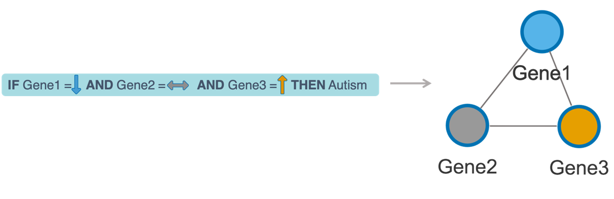

<center>
{width=30% }
</center>

***

VisuNet is an interactive tool that supports analysis of complex rule-based classifiers and helps explain their structure. VisuNet can be successfully apply to any classification problems, such as, for instance, a complex health-related decsion tasks. Rule networks can clearly identify main genes (metabolites, methylation sites, etc) and their expression levels predicting complex phenotypes, e.g. cancer, autism. VisuNet is implemented in R and uses the Shiny Gadgets attributes. The tool includes the rule network construction from rule-based models, filtration, visualization and customization. VisuNet is available on  [GitHub](https://github.com/komorowskilab/VisuNet.git)


### Rule network construction

***

A VisuNet is constructed from sets of IF-THEN rules where nodes are conjuncts in rules, ie. features with their values occurring in the rules, and an edge connects two nodes if the corresponding conjuncts occur in the same rule. 


```{r old-figure-label, echo = FALSE, message=FALSE, fig.align='center', fig.cap='Rule network construction from the rule', out.width='0.95\\linewidth', fig.pos='H'}

```

### Installation

***

```{r, echo = TRUE, fig.align='center', warning=FALSE, eval=FALSE}
devtools::install_github("komorowskilab/VisuNet")
```


### Example

***

The gene expression data for autistic and non-autistic young males uses in the example was obtained from @RN1. The rule-based classifier was created using [R.ROSETTA](https://github.com/komorowskilab/R.ROSETTA.git) [see @RN2].


```{r, echo = TRUE, fig.align='center', warning=FALSE, eval=FALSE}
require(VisuNet)

#Sample rule set for a classifier of autistic and non-autistic young males
#'Line by line' data type
data(autcon_ruleset)

#Run VisuNet
#Remember to click DONE once you finished your work with VisuNet
vis_out = visunet(autcon_ruleset, type = 'L')
```


```{r, echo = FALSE,  fig.align='center', warning=FALSE, fig.cap='Sample rule network for a autistic and non-autistic young males classifier from VisuNet (for min Support = 17 and min Accuracy = 88%)'}
vis_out = readRDS('data/visunet_out.RDS')
visNetwork(nodes = vis_out$nodes, edges = vis_out$edges)%>% 
  visLayout(randomSeed = 123) %>%
  visInteraction(hover = TRUE, navigationButtons = TRUE) %>%
  visOptions(selectedBy = list(variable = "group" , multiple = TRUE, main = "Select by decision", style = 'width: 200px; height: 30px;
                                                                padding-left: 80px;
                               font-size: 15px;
                               color: black;
                               border:none;
                               outline:none;'))
```


### References
